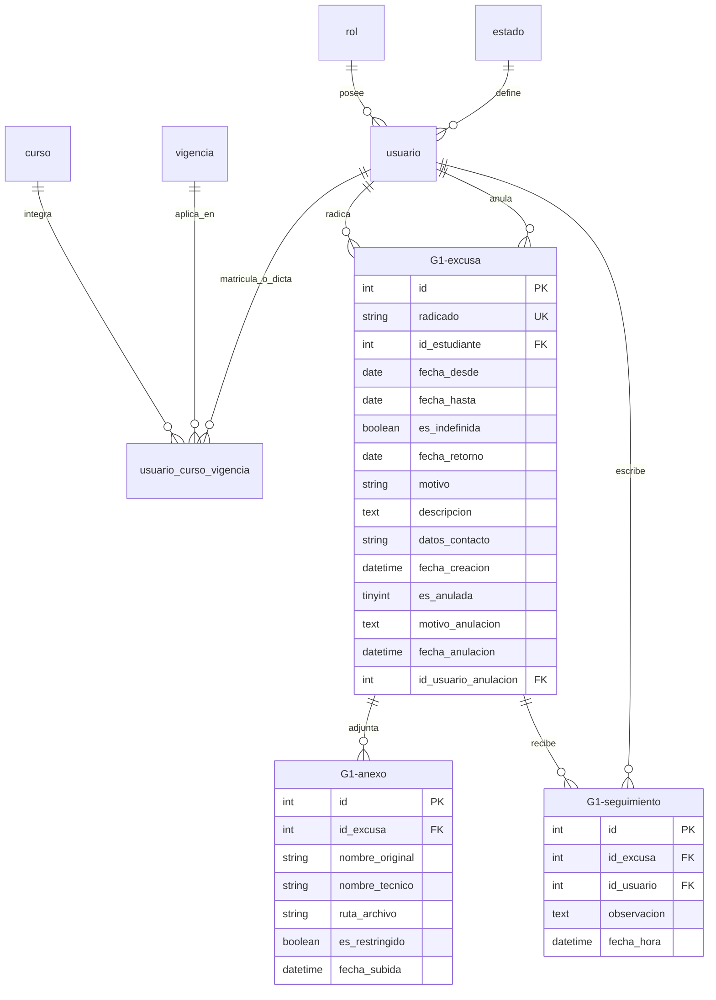

# Modelo Relacional: `bdiedlavictoria`

El sistema interactúa con la base de datos MySQL institucional **`bdiedlavictoria`**. Su diseño separa rigurosamente las **tablas maestras de la institución** (usuarios, roles, matrículas por curso y vigencia) de las **tablas transaccionales del módulo de excusas** (identificadas bajo la convención institucional del prefijo **`G1-`**).

---

## 🏛️ 1. Tablas Maestras Institucionales

Estas tablas administran la estructura orgánica y académica general del colegio. Son compartidas entre los distintos módulos de la institución:

| Tabla | Propósito Institucional | Claves / Restricciones |
| :--- | :--- | :--- |
| **`rol`** | Catálogo de perfiles de usuario (1: Coordinador, 2: Docente, 3: Estudiante). | `PK(id)`, `UNIQUE(nombre)` |
| **`estado`** | Estados de cuenta de usuarios (Activo, Inactivo). | `PK(id)`, `UNIQUE(nombre)` |
| **`usuario`** | Cuentas institucionales con credenciales cifradas con `bcryptjs`. | `PK(id)`, `UNIQUE(identificacion)`, `UNIQUE(usuario)`, `UNIQUE(email)` |
| **`curso`** | Grados académicos ofrecidos en la institución (ej. "Grado 10-A"). | `PK(id)` |
| **`vigencia`** | Años lectivos escolares (ej. Vigencia 2026: `2026-01-15` a `2026-11-30`). | `PK(id)` |
| **`usuario_curso_vigencia`**| Asignación de estudiantes y directores de grupo a cursos y años lectivos. | `PK(id_curso, id_vigencia, id_usuario)` (Compuesta) |
| **`configuracion`** | Parámetros globales del sistema (claves de radicación, límites). | `PK(id)`, `UNIQUE(clave)` |

---

## 📝 2. Tablas Transaccionales de Excusas (Prefijo `G1-`)

Las tablas propias de este proyecto utilizan el prefijo institucional **`G1-`** para evitar colisiones con otros sistemas presentes en la misma base de datos:

### Tabla: `G1-excusa`
Representa el acto formal de radicación de inasistencia escolar. Nunca se elimina físicamente; ante un error de digitación se actualizan sus columnas de anulación.

| Columna | Tipo | Nulo | Descripción |
| :--- | :--- | :--- | :--- |
| **`id`** | `INT` | NO | Clave primaria. |
| **`radicado`** | `VARCHAR(50)` | NO | Código único generado con formato `EXC-AÑO-CONSECUTIVO` (ej. `EXC-2026-00001`). |
| **`id_estudiante`** | `INT` | NO | `FK -> usuario(id)` del estudiante que presenta la excusa. |
| **`fecha_desde`** | `DATE` | NO | Fecha inicial de la inasistencia. |
| **`fecha_hasta`** | `DATE` | SÍ | Fecha final (requerida para excusas definidas; `NULL` para indefinidas abiertas). |
| **`es_indefinida`** | `BOOLEAN` | NO | `1` si es inasistencia médica o de causa mayor sin fecha de alta confirmada; `0` si tiene plazo determinado. |
| **`fecha_retorno`** | `DATE` | SÍ | Fecha formal de regreso a clases asignada al cerrar la excusa indefinida (**HU-08**). |
| **`motivo`** | `VARCHAR(100)` | NO | Categoría de la excusa (Médica, Calamidad doméstica, etc.). |
| **`descripcion`** | `TEXT` | NO | Detalle circunstanciado de los hechos que impiden la asistencia. |
| **`datos_contacto`** | `VARCHAR(150)` | NO | Teléfono y correo del acudiente responsable para verificación. |
| **`fecha_creacion`** | `DATETIME` | SÍ | Marca temporal exacta de radicación en el sistema (`CURRENT_TIMESTAMP`). |
| **`es_anulada`** | `TINYINT(1)` | NO | `0` = Activa; `1` = Anulada formalmente (libera calendario de solapamiento). |
| **`motivo_anulacion`**| `TEXT` | SÍ | Causa por la cual fue invalidada la excusa. |
| **`fecha_anulacion`** | `DATETIME` | SÍ | Momento en el que se efectuó la anulación. |
| **`id_usuario_anulacion`** | `INT` | SÍ | `FK -> usuario(id)` de la persona que ejecutó la anulación (estudiante, docente o coordinador). |

---

### Tabla: `G1-anexo`
Almacena la metadata de cada archivo probatorio adjuntado tanto al radicar como al cerrar formalmente una excusa indefinida.

| Columna | Tipo | Nulo | Descripción |
| :--- | :--- | :--- | :--- |
| **`id`** | `INT` | NO | Clave primaria. |
| **`id_excusa`** | `INT` | NO | `FK -> G1-excusa(id)` a la que pertenece la evidencia. |
| **`nombre_original`** | `VARCHAR(255)` | NO | Nombre del archivo tal como fue cargado por el usuario. |
| **`nombre_tecnico`** | `VARCHAR(255)` | NO | Nombre físico en disco generado por Multer para prevenir sobreescrituras. |
| **`ruta_archivo`** | `VARCHAR(255)` | NO | Ruta en el sistema de archivos del servidor (ej. `uploads/soporte_172...pdf`). |
| **`es_restringido`** | `BOOLEAN` | NO | `1` = Confidencial / Reserva médica (**HU-09**); solo descargable por Coordinación y autor. |
| **`fecha_subida`** | `DATETIME` | SÍ | Marca de tiempo de registro del adjunto. |

---

### Tabla: `G1-seguimiento`
Bitácora pedagógica inmutable de actuaciones, acuerdos académicos y registros de auditoría institucional.

| Columna | Tipo | Nulo | Descripción |
| :--- | :--- | :--- | :--- |
| **`id`** | `INT` | NO | Clave primaria. |
| **`id_excusa`** | `INT` | NO | `FK -> G1-excusa(id)` asociada. |
| **`id_usuario`** | `INT` | NO | `FK -> usuario(id)` del autor de la observación o evento auditado. |
| **`observacion`** | `TEXT` | NO | Contenido pedagógico o registro automático del sistema (`[ANULACIÓN FORMAL]`, `[SOLICITUD DE ANULACIÓN]`). |
| **`fecha_hora`** | `DATETIME` | SÍ | Timestamp exacto de creación. |

<Note>
**Inmutabilidad y Auditoría:** Cuando una excusa es anulada o se solicita anulación, el sistema inserta automáticamente una fila en `G1-seguimiento` documentando el nombre del autor, su rol institucional, la justificación y el momento exacto, asegurando una trazabilidad incorruptible.
</Note>
