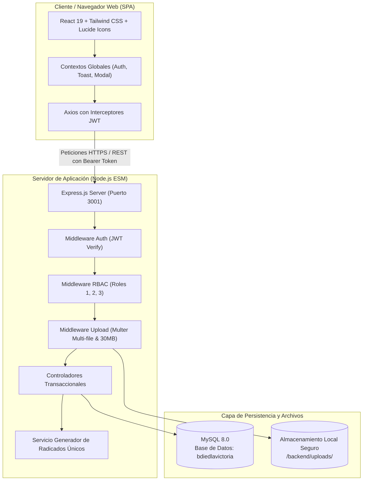

# Arquitectura Tecnológica y Componentes

El **Módulo de Radicación y Seguimiento de Excusas Escolares** de la **IED La Victoria** está diseñado bajo un modelo desacoplado cliente-servidor (SPA + API RESTful), garantizando alta disponibilidad, separación clara de responsabilidades, seguridad institucional y trazabilidad inmutable.



---

## 🛠️ Stack Tecnológico Institucional

<CardGroup cols={3}>
  <Card title="Frontend" icon="react">
    * **React 19** (Vite Bundler)
    * **Tailwind CSS v3.4** (Diseño institucional accesible)
    * **Lucide React** (Iconografía consistente)
    * **Axios** con interceptores automáticos de autenticación
  </Card>

  <Card title="Backend REST" icon="node-js">
    * **Node.js 20+** (Módulos nativos ECMAScript)
    * **Express.js 4.x**
    * **JSON Web Tokens (JWT)** para sesiones sin estado
    * **Multer** para procesamiento de archivos multipart
  </Card>

  <Card title="Base de Datos" icon="database">
    * **MySQL 8.0**
    * Motor **InnoDB** con integridad referencial estricta
    * Conexión por pool concurrente con `mysql2/promise`
    * Esquema unificado `bdiedlavictoria`
  </Card>
</CardGroup>

---

## 🔐 Seguridad y Flujo de Peticiones

Todas las comunicaciones entre el frontend y el backend siguen un protocolo estricto de autenticación y autorización:

<Steps>
  <Step title="Autenticación con Credenciales Únicas">
    El usuario inicia sesión en `POST /api/auth/login` con su usuario institucional (`[inicial][apellido][número]`) y contraseña. El backend valida el hash con `bcryptjs`.
  </Step>

  <Step title="Emisión de Token JWT">
    Si la verificación es correcta, el servidor expide un JSON Web Token firmado con clave secreta institucional, con vigencia configurable (8 horas estándar). El token incluye `id`, `usuario`, `id_rol`, `nombre` y `apellido`.
  </Step>

  <Step title="Inyección Automática en Cabeceras">
    El cliente almacena el token en almacenamiento local seguro (`localStorage`) y el interceptor de Axios inyecta automáticamente el encabezado:
    ```http
    Authorization: Bearer <TOKEN_JWT>
    ```
  </Step>

  <Step title="Validación RBAC en cada Endpoint">
    Los middlewares `verifyToken`, `requireStaff` y `requireCoordinador` interceptan las solicitudes antes de llegar al controlador, rechazando con `401 Unauthorized` o `403 Forbidden` cualquier acceso no facultado por su rol institucional.
  </Step>
</Steps>

---

## 📁 Estructura del Proyecto en el Repositorio

El repositorio está organizado en dos módulos desacoplados y una carpeta de documentación unificada:

```plaintext
gestion_excusas/
├── backend/
│   ├── config/              # Conexión al pool MySQL (db.js)
│   ├── controllers/         # Controladores transaccionales (excusas, anexos, etc.)
│   ├── database/            # DDL institucional (schema.sql), inserts.sql y seed.js
│   ├── middlewares/         # verifyToken, RBAC institucional y Multer storage
│   ├── routes/              # Endpoints agrupados por dominio REST
│   ├── services/            # Servicios transversales (generación de radicado institucional)
│   ├── uploads/             # Almacenamiento seguro de archivos físicos
│   ├── server.js            # Punto de entrada del servidor Express
│   └── test-suite.js        # Batería completa de 31 pruebas unitarias e integración
├── frontend/
│   ├── src/
│   │   ├── components/      # Componentes UI (Formulario, Tablas, Modales, Badges)
│   │   ├── context/         # AuthContext, ToastContext y estados globales
│   │   ├── pages/           # Vistas principales (Login, Portal Estudiante, Panel Docente)
│   │   ├── services/        # Clientes HTTP y llamadas de API con Axios
│   │   └── utils/           # Formateadores de fecha, cálculo de estado y constantes
│   ├── tailwind.config.js   # Paleta institucional IED La Victoria
│   └── vite.config.js       # Configuración de empaquetado y servidor de desarrollo
└── docs/                    # Documentación oficial para Mintlify
    ├── docs.json            # Configuración de navegación y marca
    ├── index.mdx            # Portada del portal
    └── ...                  # Guías de arquitectura, reglas y referencia API
```
