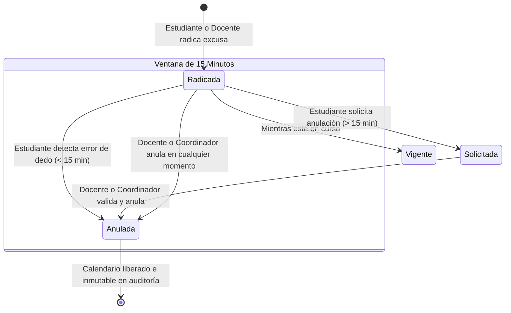

# Inmutabilidad y Auditoría Institucional

En el marco normativo del sector educativo público colombiano y de la **IED La Victoria**, los actos administrativos y soportes escolares **no se borran**. La eliminación física de registros destruiría la trazabilidad de lo ocurrido y violaría los principios de auditoría escolar.

Para solucionar equivocaciones de digitación sin romper esta regla, el sistema implementa el **Estado "Anulada"** y un sistema de auditoría doble en `G1-excusa` y `G1-seguimiento`.

---

## 🏛️ El Estado "Anulada"

Cuando una excusa es invalidada por un error formal o de fechas:

1. **Liberación del Calendario:** La excusa deja de contar para las comprobaciones de solapamiento (`AND es_anulada = 0`), permitiendo radicar la justificación correcta de inmediato.
2. **Exclusión de Métricas de Inasistencia:** Ya no suma a las estadísticas de días perdidos del estudiante ni aparece como novedad vigente del día.
3. **Preservación Forense:** Permanece almacenada en la base de datos con el registro de quién la anuló, la fecha exacta y la justificación obligatoria.



---

## ⏳ Ventana de 15 Minutos para el Estudiante

Se reconoce que durante la digitación inicial el estudiante o acudiente puede equivocarse de fecha, motivo o adjunto. Por tanto, se establecen dos vías diferenciadas:

<Tabs>
  <Tab title="⏱️ Primeros 15 Minutos (< 900 segundos)">
    * **Facultad Autónoma:** El estudiante cuenta con un botón directo para **Anular Excusa**.
    * **Justificación:** Debe ingresar un motivo claro del error (mínimo 5 caracteres).
    * **Acción Inmediata:** El sistema marca `es_anulada = 1` y registra la novedad en la bitácora `G1-seguimiento`.
    * **Efecto:** El calendario queda libre de inmediato para que el estudiante radique la excusa correcta sin intermediación administrativa.
  </Tab>

  <Tab title="🔒 Posterior a los 15 Minutos (> 900 segundos)">
    * **Bloqueo de Seguridad:** El estudiante ya **no** puede anular la excusa por sí mismo para evitar alteraciones extemporáneas.
    * **Solicitud Formal de Anulación:** El sistema habilita la opción de **"Solicitar Anulación Formal"**.
    * **Registro en Bitácora:** Se inserta automáticamente en `G1-seguimiento` un registro con el prefijo:
      ```plaintext
      [SOLICITUD DE ANULACIÓN] Solicitud enviada por el estudiante Juan Pérez. Motivo: Me equivoqué de semana, era del 20 al 22.
      ```
    * **Resolución Docente/Coordinación:** El personal educativo revisa la solicitud en el panel y procede a anular la excusa con su propio aval.
  </Tab>
</Tabs>

---

## 👩‍🏫 Anulación Directa por Docentes y Coordinadores

Los docentes y directivos de la IED La Victoria tienen potestad para anular una excusa en **cualquier momento** si se presenta alguna de las siguientes situaciones:
* El estudiante radicó una fecha no acorde con la realidad observada en el aula.
* Se comprobó falsedad o inconsistencia en la justificación.
* Se dio trámite a una solicitud de anulación enviada por el estudiante.

En todos los casos, el sistema exige ingresar obligatoriamente una justificación y almacena:
* `es_anulada = 1`
* `motivo_anulacion = [Justificación ingresada]`
* `fecha_anulacion = NOW()`
* `id_usuario_anulacion = req.user.id`

Y crea la entrada en `G1-seguimiento`:
```plaintext
[ANULACIÓN FORMAL] Excusa anulada por Docente Carlos Restrepo (Docente). Motivo: Error comprobado de digitación a petición del acudiente.
```

---

## ✍️ Regla de Edición y Eliminación de Seguimientos Pedagógicos

Las observaciones pedagógicas que los docentes escriben sobre una excusa (`G1-seguimiento`) también siguen una política de control temporal:

| Acción | Plazo Permitido | Autorizado | Justificación |
| :--- | :--- | :--- | :--- |
| **Editar Observación** | **Primeros 15 minutos** tras su redacción | Únicamente el docente o coordinador autor | Permite corregir erratas o errores ortográficos inmediatos sin alterar el historial a largo plazo. |
| **Eliminar Observación** | **En cualquier momento** | Autor original o Coordinador escolar (`rol = 1`) | Si la observación ya no aplica o pasaron los 15 minutos, debe removerse formalmente de la bitácora. |

<Tip>
El cálculo de los 15 minutos en el backend se realiza directamente sobre el motor de base de datos utilizando la función:
```sql
TIMESTAMPDIFF(SECOND, fecha_creacion, NOW()) <= 900
```
Esto previene manipulaciones del reloj del cliente o desincronizaciones horarias locales.
</Tip>
