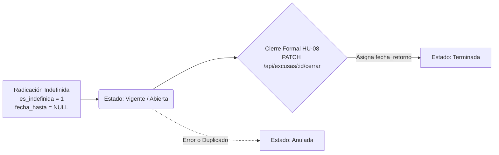

# Gestión y Cierre Formal de Excusas Indefinidas

En la vida escolar se presentan situaciones de fuerza mayor, tales como tratamientos médicos prolongados, intervenciones quirúrgicas u hospitalizaciones, en las que **no es factible fijar una fecha de culminación anticipada** al momento de radicar la inasistencia.

El sistema de la IED La Victoria contempla esta realidad mediante las **Excusas Indefinidas** y su procedimiento de cierre formal (**HU-08**).

---

## 🏷️ Terminología de Estados y Modalidades

Para facilitar la comprensión tanto de estudiantes como de docentes, las modalidades se presentan en la interfaz con términos unificados y claros:

| Modalidad Mostrada | Condición Lógica en Base de Datos | Significado Institucional |
| :--- | :--- | :--- |
| **Vigente** | `es_anulada = 0` y la fecha actual se encuentra dentro del rango de cobertura activa (`CURDATE() BETWEEN fecha_desde AND COALESCE(fecha_retorno, fecha_hasta, '9999-12-31')`). | La inasistencia está en pleno desarrollo. El estudiante no asiste a clases y sus docentes están prevenidos. |
| **Expirada** | `es_anulada = 0`, de plazo definido (`es_indefinida = 0`) y la fecha límite `fecha_hasta < CURDATE()`. | La excusa concluyó de manera natural por haber llegado a su fecha de vencimiento. |
| **Terminada** | `es_anulada = 0`, era indefinida (`es_indefinida = 1`) y ya cuenta con registro formal de `fecha_retorno`. | El estudiante completó su recuperación y formalizó su fecha de reingreso escolar (**HU-08**). |
| **Anulada** | `es_anulada = 1` | La excusa fue revocada formalmente por error o inconsistencia. No tiene validez y libera el calendario. |

---

## 🔄 Ciclo de Vida de una Excusa Indefinida

<Steps>
  <Step title="1. Radicación Inicial">
    El estudiante marca la casilla *¿Es de término indefinido?* en el formulario. No se requiere ingresar `fecha_hasta`. El sistema almacena `es_indefinida = 1` y bloquea temporalmente el calendario hacia adelante para evitar solapamientos.
  </Step>

  <Step title="2. Período de Convalecencia">
    Durante este lapso, la excusa aparece destacada en color azul con la insignia **Vigente (Abierta)** en los listados institucionales y paneles docentes.
  </Step>

  <Step title="3. Cierre Formal con Fecha de Retorno (HU-08)">
    Al recibir el alta médica o finalizar la causa de fuerza mayor, el estudiante, su docente o la coordinación registran la fecha oficial de regreso (`fecha_retorno`).
  </Step>

  <Step title="4. Transición a Estado 'Terminada'">
    Una vez registrada la fecha de retorno, la excusa pasa a modalidad **Terminada**. El intervalo de inasistencia queda acotado a $[\text{fecha\_desde}, \text{fecha\_retorno}]$ y el calendario escolar a partir del día siguiente queda plenamente disponible para futuras radicaciones.
  </Step>
</Steps>

---

## 🩺 Criterios del Cierre Formal (**HU-08**)

Al ejecutar el cierre formal de una excusa indefinida mediante `PATCH /api/excusas/:id/cerrar`:

1. **Fecha de Retorno Obligatoria:** Debe indicarse una `fecha_retorno` válida que sea igual o posterior a la `fecha_desde` de la excusa.
2. **Soportes Médicos Opcionales:** Adjuntar documentos de alta médica o comprobantes de egreso hospitalario es **completamente opcional**. Si el estudiante no cuenta con archivo digital o el alta fue verbal certificada por el acudiente, la excusa puede cerrarse igualmente.
3. **Soporte Multi-Archivo (Hasta 5 archivos, máx 30 MB):** Si se presentan soportes médicos, se pueden anexar hasta 5 archivos en la misma operación con un peso conjunto de hasta 30 MB.
4. **Reserva Médica y Confidencialidad Individual:** Cada archivo adjuntado puede marcarse de forma independiente como **Confidencial**, asegurando la protección de datos médicos sensibles (**HU-09**).

<Note>
**Validación de Permisos en el Cierre:**
* Si quien cierra es un estudiante (`rol = 3`), el sistema verifica estrictamente que sea el titular de la excusa (`excusa.id_estudiante === req.user.id`).
* Los docentes (`rol = 2`) y coordinadores (`rol = 1`) pueden registrar el cierre de la excusa de cualquier estudiante tras recibir los comprobantes correspondientes.
</Note>
